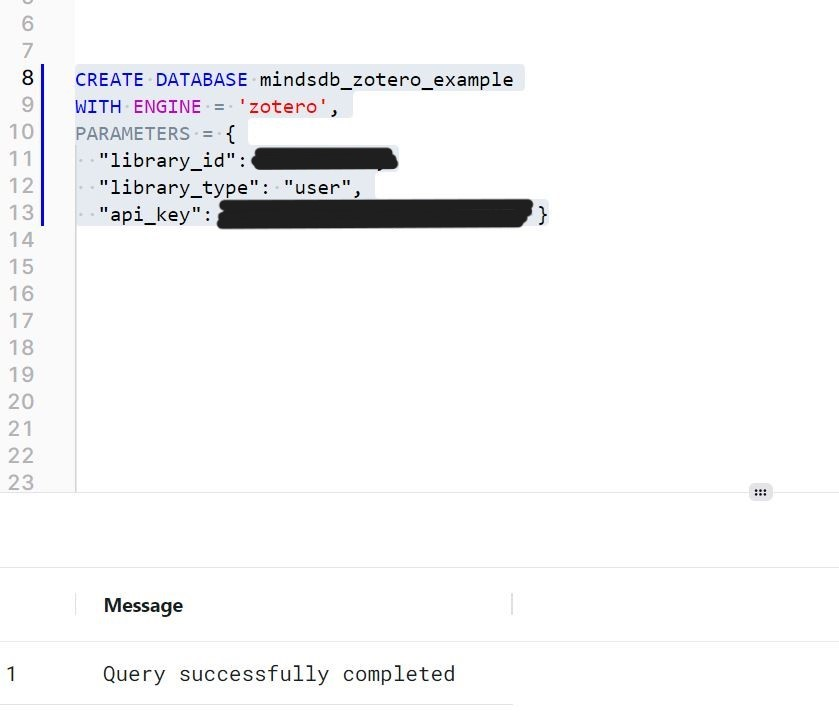
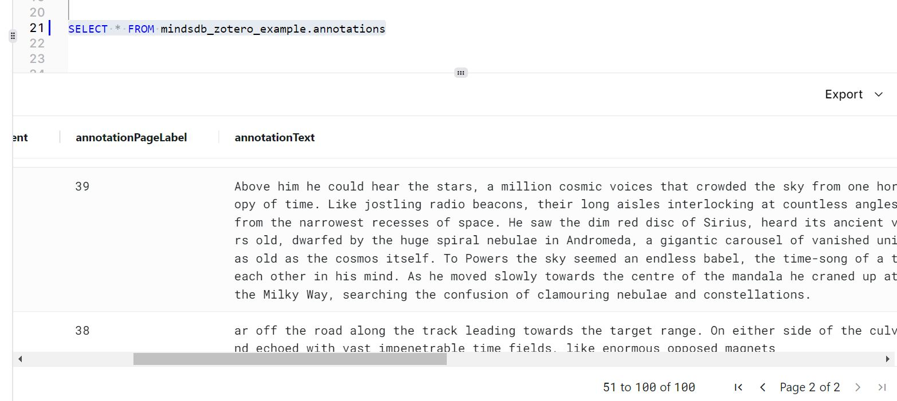
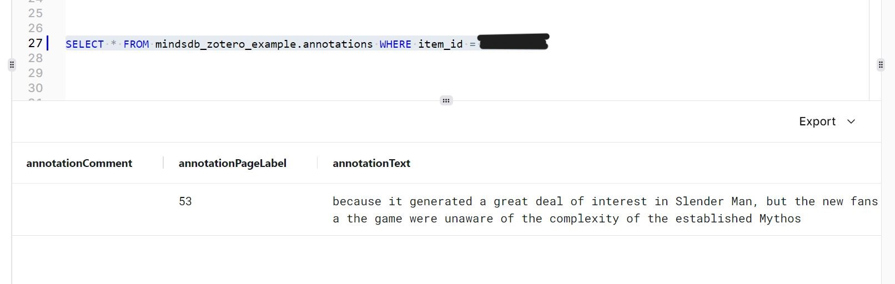
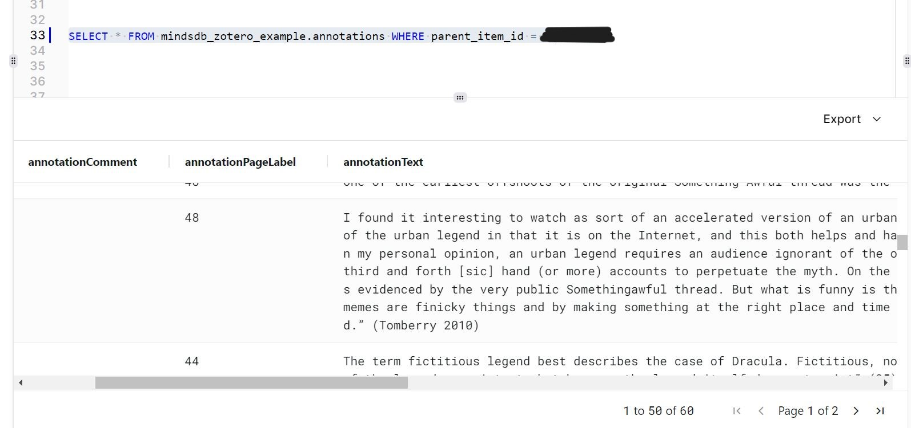
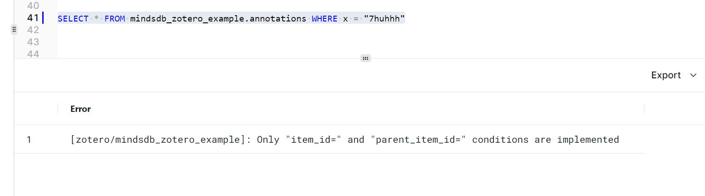

# Testing (QA) MindsDB Zotero Handler

## Test Cases
#### Create DB for Zotero:

----- 
#### Select All annotations:

-----
#### Select an annotation by ID:

-----
#### Select an annotation by ID:

-----
#### Select annotations by parent item ID:

-----
#### Correctly outputed error message when incorrect parameters are called in query

## Result
Tests of the Zotero handler cases are working fine.
